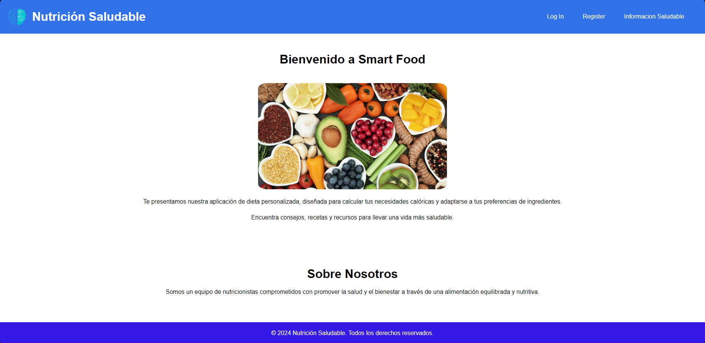
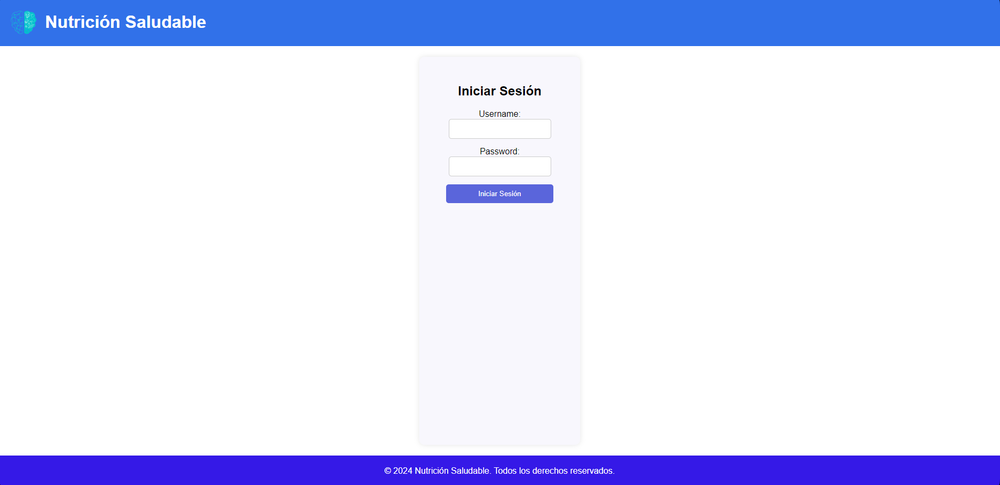
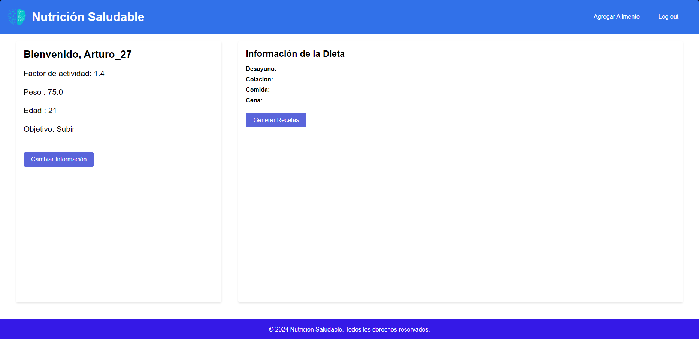
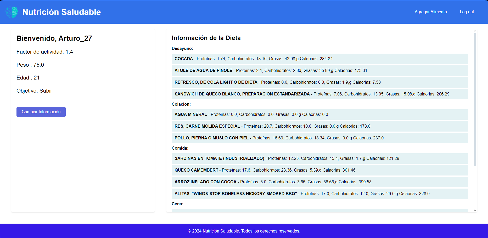

# SmartFood

Welcome to SmartFood! This project is dedicated to enhancing everyone's nutritional health and quality of life.

  

<h3 align="center">The core feature of SmartFood is a diet generator powered by a genetic algorithm.</h3>

<h4>What is SmartFood?</h4>
SmartFood is a web application built with Django as the backend. It allows users to create an account and log in to access personalized diet plans.

The following are some images from the web application:

#### Main Page of SmartFood

  

#### Login

  

#### Home Session

  

Once the user has successfully created an account, just one click is needed to generate a diet that exactly matches the user's objective.

  

Another functionality of the app allows users to update their information at any moment.
